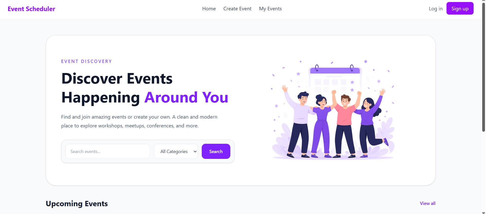
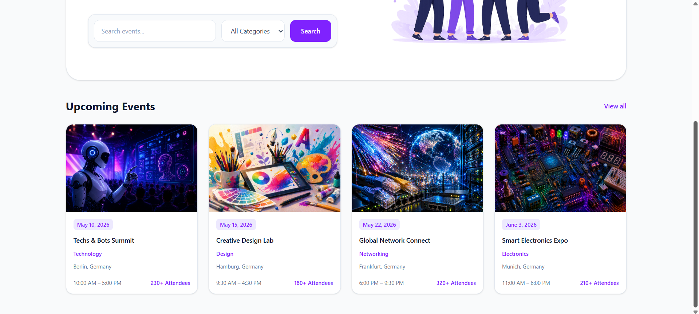
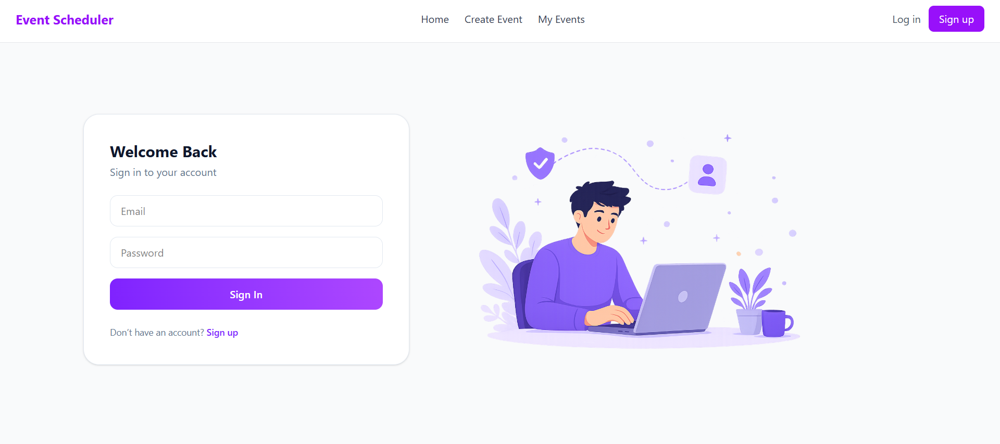
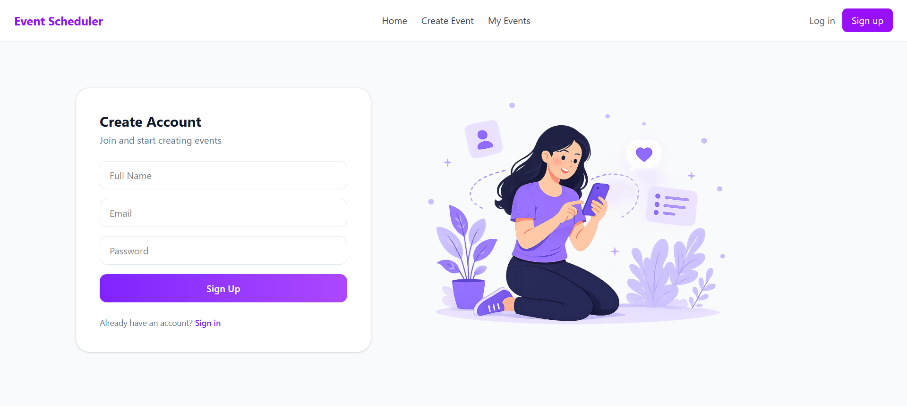
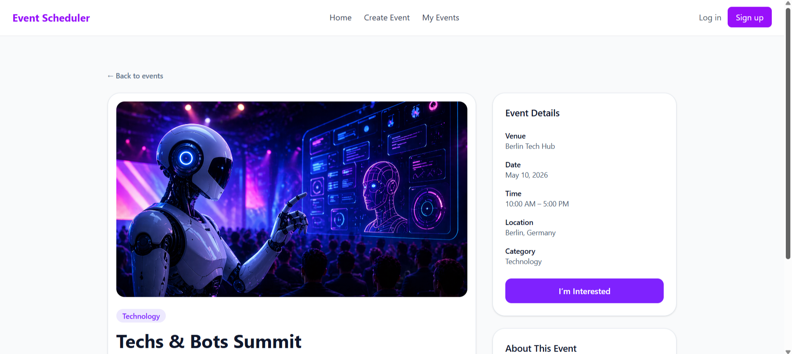
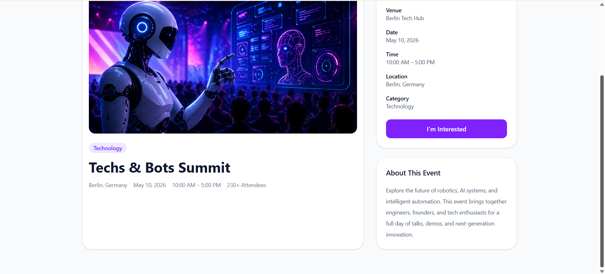
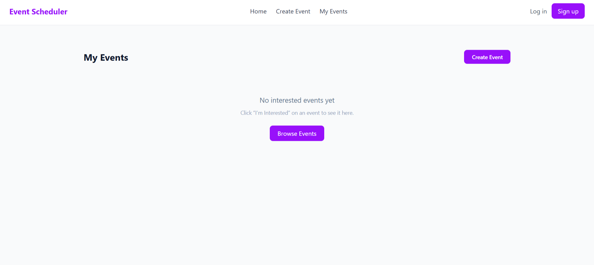
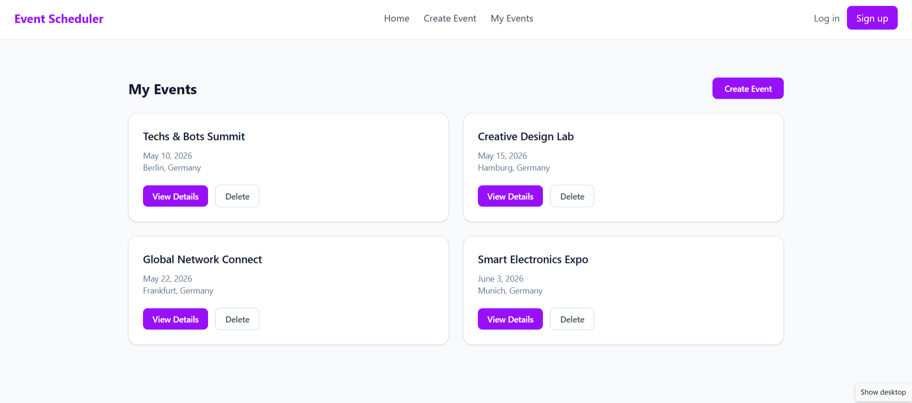
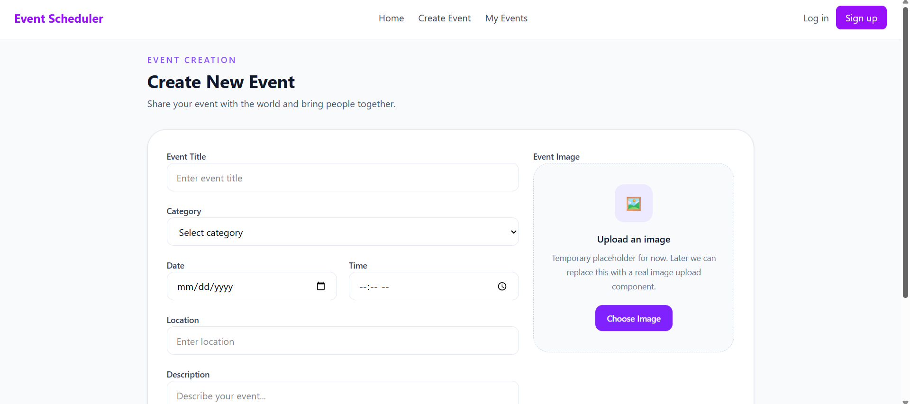
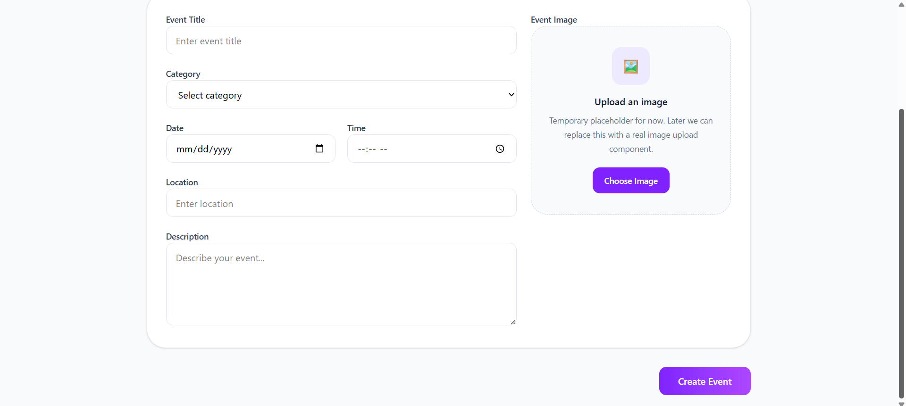

# Event Scheduler

A modern React-based event platform built with a UI-first approach.

This project focuses on creating a clean, structured, and scalable frontend before integrating real backend logic.

---
## Preview

### Home

### Authentication

### Event Details

### My Events

### Create Event

---

## Tech Stack

- React (Vite)
- React Router
- TailwindCSS
- LocalStorage (for temporary state persistence)

---

## Current Features

- Event catalog with curated UI design
- Event details page with dynamic routing
- "I'm Interested" feature (stored in localStorage)
- My Events page (add/remove events)
- Clean and responsive UI
- Component-based architecture

---

## Project Approach

This project is developed using a **UI-first strategy**.

The goal is to:
- Define a clear user experience and structure first
- Build a consistent and scalable component system
- Then incrementally add logic, state management, and backend integration

---

## Current Status

- UI is fully implemented
- Demo is ready
- Core user flows are working

Next steps:
- API integration (fetch events)
- Authentication (Sign In / Sign Up)
- Protected routes
- Create Event functionality
- Error handling and data flow improvements

---

## Project Structure

src/
components/
pages/
layouts/
routes/
data/

- Components: reusable UI elements
- Pages: route-based views
- Layouts: shared layout structure
- Routes: application routing logic
- Data: temporary static data

---

## Notes

The current UI and structure are intentionally kept stable.  
Further development will focus on logic and backend integration without major UI changes.

---

## Team
- Sascha
- Henrique
- Behzad

